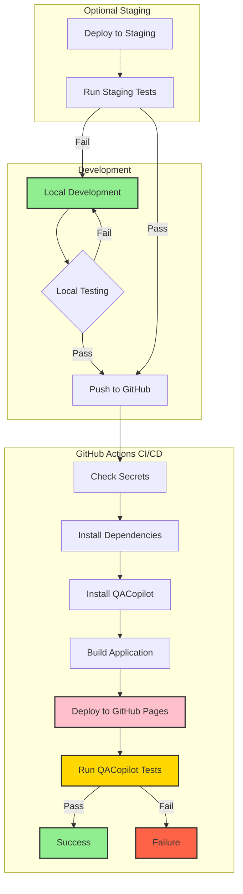

# CI/CD Workflow Diagram

## Workflow Explained

1. **Development**:
   - Developers write code locally
   - Run local tests (`npm run test:local`) to verify functionality
   - If tests pass, push to GitHub; if not, fix issues

2. **GitHub Actions CI/CD**:
   - Triggered on push to main branch
   - Checks required secrets (TC_PROJECT_ID and TC_API_KEY)
   - Installs dependencies and QACopilot
   - Builds the application
   - Deploys to GitHub Pages (production)
   - Runs QACopilot tests against the live production site
   - Reports success or failure

3. **Optional Staging** (if implemented):
   - Before pushing to main, code can be deployed to a staging environment
   - Run staging tests (`npm run test:staging`)
   - If tests pass, proceed to push to GitHub; if not, return to development

This workflow ensures code is thoroughly tested before and after deployment, maintaining high quality and reducing production issues.
